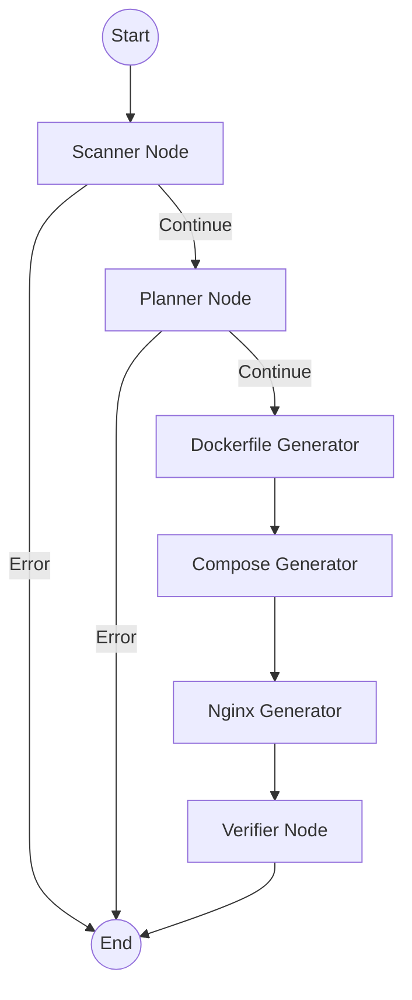

# DeployPilot-AI Repo Analyzer

DeployPilot-AI Repo Analyzer is an intelligent deployment companion that scans GitHub repositories and automatically prepares them for production deployment. Using a LangGraph-based workflow powered by Amazon Bedrock (Claude 3 Haiku), it analyzes the repository structure, detects the tech stack, infers required external services, and generates optimized, production-ready infrastructure files (Dockerfile, docker-compose.yml, nginx.conf).

## Features

- **Automated Repository Scanning:** Fetches file trees and key file contents (`package.json`, `requirements.txt`, etc.) from any public or private GitHub repository using your GitHub token.
- **Intelligent Stack Detection:** Automatically infers the application's tech stack, entry port, and needed external services (like databases, Redis, etc.).
- **Production-Ready Dockerfile Generation:** Creates multi-stage, secure, and optimized Dockerfiles for your application.
- **Docker Compose Setup:** Generates a `docker-compose.yml` file to handle your application and any required external dependencies for local or dev deployment.
- **Nginx Reverse Proxy Configuration:** Automatically produces an `nginx.conf` for a secure, production-grade reverse proxy.
- **RESTful API:** Developed with FastAPI to provide a fast and reliable `/analyze` endpoint for CI/CD or dashboard integration.

## Architecture

The AI reasoning engine uses a state-based workflow (LangGraph) to process repositories step-by-step:



## Installation

1. **Clone the repository:**
   ```bash
   git clone https://github.com/anirudh-makuluri/deploypilot-ai
   cd deploypilot-ai
   ```

2. **Set up a virtual environment and install dependencies:**
   ```bash
   python -m venv venv
   source venv/bin/activate  # On Windows use `venv\Scripts\activate`
   pip install -r requirements.txt
   ```

3. **Configure Environment Variables:**
   Create a `.env` file in the root directory and add the following:
   ```env
   # Ensure you have your AWS access credentials configured for Amazon Bedrock
   AWS_ACCESS_KEY_ID=your_aws_access_key
   AWS_SECRET_ACCESS_KEY=your_aws_secret_key
   AWS_DEFAULT_REGION=your_aws_region
   BEDROCK_MODEL_ID=anthropic.claude-3-haiku-20240307-v1:0
   PORT=8080
   ```

## Usage

1. **Start the application:**
   ```bash
   python app.py
   # Or run directly with uvicorn
   # uvicorn app:app --host 0.0.0.0 --port 8080
   ```

2. **Analyze a Repository:**
   Send a `POST` request to the `/analyze` endpoint:
   
   ```bash
   curl -X POST http://localhost:8080/analyze \
        -H "Content-Type: application/json" \
        -d '{
              "repo_url": "https://github.com/user/repo-name",
              "github_token": "your_github_personal_access_token",
              "max_files": 50
            }'
   ```

3. **Response Structure:**
   The API will respond with JSON containing the detected stack, services needed, entry port, and all the generated infrastructure code (`dockerfile`, `docker_compose`, `nginx_conf`), alongside identified deployment risks and confidence score.

## Tech Stack

- **FastAPI** & **Uvicorn**: High-performance REST API.
- **LangChain** & **LangGraph**: State-based agentic workflow design.
- **Amazon Bedrock (Claude 3 Haiku)**: The AI reasoning engine used for stack inference and infrastructure code generation.
- **GitHub API**: For repository file analysis.

## License

This project is open-source and available under the MIT License.
