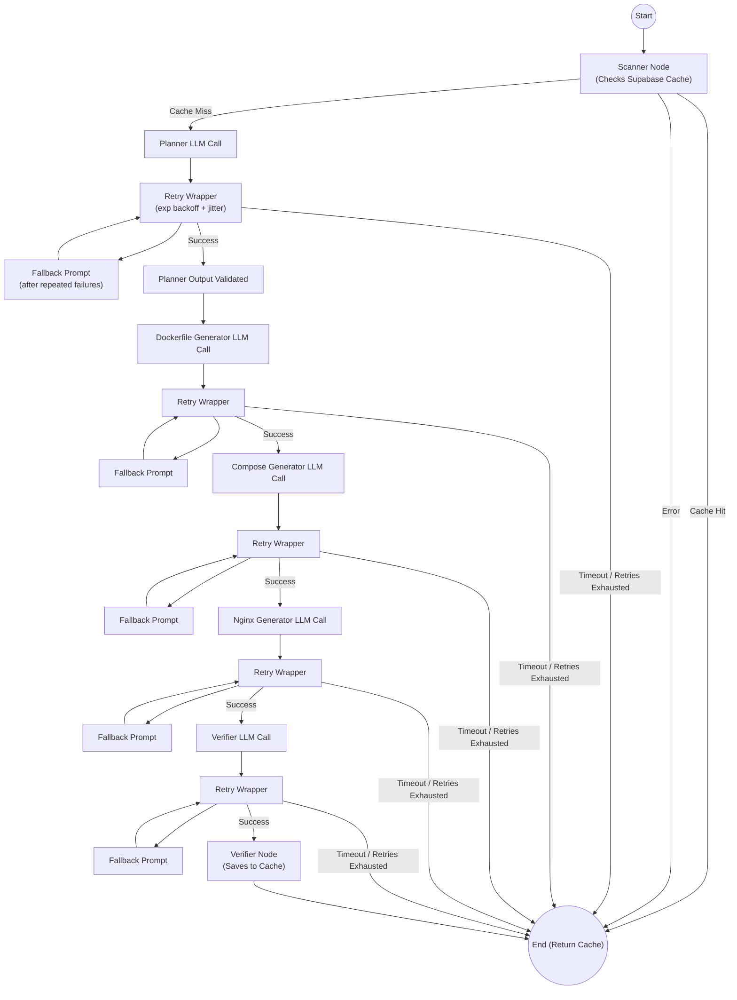

# SD-Artifacts Repo Analyzer

SD-Artifacts Repo Analyzer is an intelligent deployment companion that scans GitHub repositories and automatically prepares them for production deployment. Using a LangGraph-based workflow powered by Amazon Bedrock (Claude 3 Haiku), it analyzes the repository structure, detects the tech stack, infers required external services, and generates optimized, production-ready infrastructure files (Dockerfile, docker-compose.yml, nginx.conf).

## Features

- **Automated Repository Scanning:** Fetches file trees and key file contents (`package.json`, `requirements.txt`, selected deploy-related markdown docs, etc.) from any public or private GitHub repository using your GitHub token.
- **Intelligent Stack Detection:** Automatically infers the application's tech stack, entry port, and needed external services (like databases, Redis, etc.).
- **Production-Ready Dockerfile Generation:** Creates multi-stage, secure, and optimized Dockerfiles for your application.
- **Docker Compose Setup:** Generates a `docker-compose.yml` file to handle your application and any required external dependencies for local or dev deployment.
- **Nginx Reverse Proxy Configuration:** Automatically produces an `nginx.conf` for a secure, production-grade reverse proxy.
- **RESTful API & Streaming:** Developed with FastAPI to provide a fast `/analyze` endpoint and a real-time `/analyze/stream` Server-Sent Events (SSE) endpoint for CI/CD or dashboard integration.
- **Feedback-Driven Multi-Agent Remediation:** A `/feedback` endpoint runs a coordinator + specialized file agents workflow that decides which artifacts to change (Dockerfile/compose/nginx), applies targeted fixes, and re-verifies confidence and risks.
- **Retry Logic & Error Recovery:** LLM-powered nodes use exponential backoff retries, timeout budgets, and fallback prompts for malformed or unstable model responses.

## Stack Tokens

Stack token definitions are centralized so scanning, port inference, and benchmark labeling stay consistent.

- Code registry: `tools/stack_tokens.py`
- Human-readable reference: `benchmarks/stack_tokens.md`

Use canonical tokens from this registry in `required_stack_tokens` entries inside benchmark label files.

## Retry and Timeout Behavior

The planner, Dockerfile generator, compose generator, nginx generator, and verifier nodes all run through a shared retry wrapper.

The feedback coordinator and feedback remediation agents also run through the same retry wrapper.

- Retries: Exponential backoff with jitter for transient LLM failures.
- Validation recovery: Structured output and JSON parsing failures are retried.
- Timeout budget: Each node has a max time budget to avoid indefinite hangs.
- Prompt fallback: After repeated failures, each node switches to a simpler fallback prompt.

Current defaults are defined in `graph/nodes/llm_config.py` (`RETRY_CONFIGS` and `FALLBACK_PROMPTS`).

## Feedback Remediation Workflow

The `/feedback` endpoint uses a second LangGraph workflow that runs after an existing cached analysis is found for a given `repo_url + commit_sha`.

Flow:

1. **Coordinator Agent:** Reads user feedback, prior hadolint warnings, and prior risks; emits a per-artifact change plan.
2. **Dockerfile Improver Agent:** Applies targeted changes only for services marked `should_change=true`.
3. **Compose Improver Agent:** Updates `docker-compose.yml` only when needed.
4. **Nginx Improver Agent:** Updates `nginx.conf` only when needed.
5. **Verifier Agent:** Re-runs hadolint + risk/confidence review and returns the updated quality assessment.

If the coordinator fails, a fallback plan marks all artifacts as changeable so remediation can still proceed.

## Architecture

The AI reasoning engine uses a state-based workflow (LangGraph) to process repositories step-by-step:



## Installation

1. **Clone the repository:**
   ```bash
   git clone https://github.com/anirudh-makuluri/sd-artifacts
   cd sd-artifacts
   ```

2. **Set up a virtual environment and install dependencies:**
   ```bash
   python -m venv venv
   source venv/bin/activate  # On Windows use `venv\Scripts\activate`
   pip install -r requirements.txt
   ```

3. **Install Hadolint (Required for Verifier Node):**
   The Verifier node automatically runs `hadolint` to perform static code analysis on the generated Dockerfiles.
   - **macOS/Linux:** `brew install hadolint`
   - **Windows:** `scoop install hadolint`
   - Or download from [their releases page](https://github.com/hadolint/hadolint/releases).

3. **Configure Environment Variables:**
   Create a `.env` file in the root directory and add the following:
   ```env
   # Ensure you have your AWS access credentials configured for Amazon Bedrock
   AWS_ACCESS_KEY_ID=your_aws_access_key
   AWS_SECRET_ACCESS_KEY=your_aws_secret_key
   AWS_DEFAULT_REGION=your_aws_region
   BEDROCK_MODEL_ID=anthropic.claude-3-haiku-20240307-v1:0
  SUPABASE_URL=your_supabase_project_url
  SUPABASE_SERVICE_ROLE_KEY=your_supabase_service_role_key
   PORT=8080
   ```

4. **Initialize Supabase Tables:**
  Run `supabase_schema.sql` in your Supabase SQL editor to create:
  - `analysis_cache`
  - `example_bank` (for Dockerfile/compose reference examples)

## Usage

1. **Start the application:**
   ```bash
   python app.py
   # Or run directly with uvicorn
   # uvicorn app:app --host 0.0.0.0 --port 8080
   ```

2. **Analyze a Repository (Standard):**
  Send a `POST` request to the `/analyze` endpoint.
  `github_token` is optional for public repositories and required for private repositories:
   
   ```bash
   curl -X POST http://localhost:8080/analyze \
        -H "Content-Type: application/json" \
        -d '{
              "repo_url": "https://github.com/user/repo-name",
              "max_files": 50
            }'
   ```

3. **Analyze a Repository (Streaming):**
  For real-time progress, send a `POST` request to the `/analyze/stream` endpoint. It returns Server-Sent Events (SSE).
  `github_token` is optional for public repositories and required for private repositories:
   
   ```bash
   # Use -N to keep the curl stream open
   curl -N -X POST http://localhost:8080/analyze/stream \
        -H "Content-Type: application/json" \
        -d '{
            "repo_url": "https://github.com/user/repo-name"
            }'
   ```
   **Output Format:**
   ```text
   event: progress
   data: {"node": "scanner", "status": "completed"}
   
   event: progress
   data: {"node": "planner", "status": "completed"}
   ...
   event: complete
   data: { ... full JSON response ... }
   ```

 4. **Response Structure:**
   The API will respond with JSON containing the detected stack, services needed, entry port, and all the generated infrastructure code (`dockerfile`, `docker_compose`, `nginx_conf`), alongside identified deployment risks and confidence score.

   **Example Response:**
   ```json
   {
     "commit_sha": "abc123def4567890",
     "stack_summary": "Next.js React app with WebSocket server",
     "stack_tokens": ["node", "next", "react", "nginx"],
     "services": [
       {
         "name": "app",
         "build_context": ".",
         "port": 3000,
         "dockerfile_path": "Dockerfile"
       },
       {
         "name": "websocket",
         "build_context": ".",
         "port": 4001,
         "dockerfile_path": "Dockerfile.websocket"
       }
     ],
     "dockerfiles": { ... },
     "docker_compose": "...",
     "nginx_conf": "...",
     "has_existing_dockerfiles": true,
     "has_existing_compose": true,
     "risks": [
       "- The Dockerfile for the \"app\" service does not pin the version of the apk packages installed..."
     ],
     "confidence": 0.8,
     "hadolint_results": {
       "app": "-:7 DL3018 warning: Pin versions in apk add. Instead of `apk add <package>` use `apk add <package>=<version>`",
       "websocket": ""
     },
     "token_usage": {
       "input_tokens": 11796,
       "output_tokens": 2507,
       "total_tokens": 14303
     }
   }
   ```

5. **Seed the Example Bank (Supabase):**
   Seed from your own curated list of repositories:
   ```bash
   curl -X POST http://localhost:8080/examples/seed \
        -H "Content-Type: application/json" \
        -d '{
              "repo_urls": [
                "https://github.com/vercel/next.js",
                "https://github.com/tiangolo/full-stack-fastapi-template"
              ],
              "max_files_per_repo": 20,
              "permissive_only": true
            }'
   ```

   Or seed from the built-in popular repository list:
   ```bash
   curl -X POST "http://localhost:8080/examples/seed/popular"
   ```

6. **Preview Retrieved Examples (Debug):**
   This lets you inspect what examples will be sent into generation prompts:
   ```bash
   curl -X POST http://localhost:8080/examples/preview \
        -H "Content-Type: application/json" \
        -d '{
              "artifact_type": "dockerfile",
              "detected_stack": "Next.js app with Node backend",
              "stack_tokens": ["node", "next", "react"],
              "service": {"name": "web", "build_context": "."},
              "limit": 3
            }'
   ```

   `stack_tokens` is optional but preferred when available.

7. **Delete Cached Analysis Result:**
   Delete cached entries for a repository. Provide `commit_sha` to delete one specific cached result, or omit it to delete all cache rows for the repository.
   ```bash
   curl -X DELETE http://localhost:8080/cache \
        -H "Content-Type: application/json" \
        -d '{
              "repo_url": "https://github.com/user/repo-name",
              "commit_sha": "abc123def456"
            }'
   ```

8. **Improve Existing Results Using Feedback:**
   Use this when an analyzed repo has deployment issues and you want targeted iteration over existing generated artifacts.

## Scan Quality Benchmarking (Objective Metrics)

You can benchmark scanner/planner accuracy using a lightweight labels file as the source of truth.

### 1) Prepare labels

Create `benchmarks/example_bank_labels.json` using `benchmarks/example_bank_labels.sample.json` as a template.

Label fields:
- `repo_url`: preferred full GitHub repo URL
- `repo`: optional GitHub full name (`owner/repo`) if `repo_url` is omitted
- `package_path`: optional repo subpath to evaluate (default `.`)
- `required_stack_tokens`: canonical tokens expected in predicted stack tokens (e.g. `next`, `node`, `fastapi`)
- `expected_services`: ground-truth deployable services (`name`, `build_context`)
- `excluded_services`: services that must be excluded (for mobile leakage checks)
- `expected_ports`: optional known ports by service name

Notes:
- Labels are evaluated as targets (`repo_url + package_path`), so you can include multiple entries for the same repo.
- This is useful for monorepos where deployable examples live under subpaths.

### 2) Run benchmark

```bash
python tools/evaluate_scan_quality.py \
  --labels-file benchmarks/example_bank_labels.json \
  --max-files 50
```

Behavior:
- The script evaluates only entries present in the labels file.
- `--repos` acts only as a filter over the labeled entries.
- Output report is written to `benchmarks/scan-quality-<timestamp>.json`.

### 3) Metrics reported

- `service_precision`, `service_recall`, `service_f1`
- `mobile_leakage_rate`
- `stack_accuracy` (on repos with `required_stack_tokens` labels)
- `port_accuracy_known` and `port_unknown_rate` (on labeled ports)
- repo-level TP/FP/FN and mismatch details

### 4) Recommended gates

- `service_precision >= 0.92`
- `service_recall >= 0.90`
- `mobile_leakage_rate <= 0.02`
- `stack_accuracy >= 0.90` (for labeled repos)
- `port_accuracy_known >= 0.90`

   ```bash
   curl -X POST http://localhost:8080/feedback \
        -H "Content-Type: application/json" \
        -d '{
              "repo_url": "https://github.com/user/repo-name",
              "commit_sha": "abc123def456",
              "feedback": "The API container fails health checks and nginx is not routing /api correctly"
            }'
   ```

   Notes:
   - `repo_url + commit_sha` must already exist in `analysis_cache`.
   - The response shape is the same as `/analyze` (updated artifacts, risks, confidence, hadolint results).
   - The improved result is upserted back into cache for that same `repo_url + commit_sha`.

9. **Improve Existing Results Using Feedback (Streaming):**
   For real-time feedback remediation progress, call `/feedback/stream`.

   ```bash
   # Use -N to keep the curl stream open
   curl -N -X POST http://localhost:8080/feedback/stream \
        -H "Content-Type: application/json" \
        -d '{
              "repo_url": "https://github.com/user/repo-name",
              "commit_sha": "abc123def456",
              "feedback": "The API container fails health checks and nginx is not routing /api correctly"
            }'
   ```

   **Output Format:**
   ```text
   event: progress
   data: {"node": "feedback_coordinator", "status": "completed"}

   event: progress
   data: {"node": "dockerfile_improver", "status": "completed"}
   ...
   event: complete
   data: { ... full JSON response ... }
   ```

## Tech Stack

- **FastAPI** & **Uvicorn**: High-performance REST API.
- **LangChain** & **LangGraph**: State-based agentic workflow design.
- **Amazon Bedrock (Claude Haiku)**: The AI reasoning engine used for stack inference and infrastructure code generation.
- **GitHub API**: For repository file analysis.

## License

This project is open-source and available under the MIT License.
