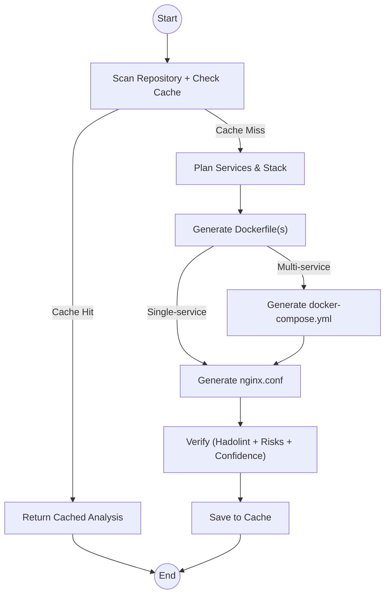

# SD-Artifacts Repo Analyzer

SD-Artifacts is an AI deployment companion that scans GitHub repositories and generates production-ready infrastructure artifacts. It detects stack and services, infers ports and dependencies, and outputs Dockerfile(s), docker-compose.yml, and nginx.conf using a LangGraph multi-agent workflow.

## Key Features

- Automated repository scanning from GitHub (public and private with token).
- Stack token inference and deployable service extraction.
- Production-oriented Dockerfile generation with hadolint-aware verification.
- Conditional compose generation for multi-service repos and nginx generation for reverse-proxy setup.
- Streaming endpoints (`/analyze/stream`, `/feedback/stream`) for real-time progress.
- Supabase-backed analysis cache and example bank retrieval.
- Benchmark runner for planner quality plus Dockerfile/compose/nginx artifact scoring.

## Architecture



## Quick Start

1. Clone and install dependencies.

```bash
git clone https://github.com/anirudh-makuluri/sd-artifacts
cd sd-artifacts
python -m venv venv
# Windows
venv\Scripts\activate
# macOS/Linux
# source venv/bin/activate
pip install -r requirements.txt
```

2. Install hadolint (used by verifier).
- macOS/Linux: `brew install hadolint`
- Windows: `scoop install hadolint`
- Or install from GitHub releases.

3. Create `.env` in project root.

```env
AWS_ACCESS_KEY_ID=your_aws_access_key
AWS_SECRET_ACCESS_KEY=your_aws_secret_key
AWS_DEFAULT_REGION=your_aws_region
BEDROCK_MODEL_ID=anthropic.claude-3-haiku-20240307-v1:0
SUPABASE_URL=your_supabase_project_url
SUPABASE_SERVICE_ROLE_KEY=your_supabase_service_role_key
PORT=8080
```

4. Initialize Supabase schema.
- Run `supabase_schema.sql` in Supabase SQL editor.

5. Start API.

```bash
python app.py
# or
# uvicorn app:app --host 0.0.0.0 --port 8080
```

## API Summary

- `POST /analyze`: full analysis and artifact generation.
- `POST /analyze/stream`: same analysis with SSE progress events.
- `POST /feedback`: targeted artifact remediation for existing cache entries.
- `POST /feedback/stream`: remediation with SSE progress events.
- `POST /examples/seed`: seed example bank from repo list.
- `POST /examples/seed/popular`: seed from built-in popular list.
- `POST /examples/preview`: inspect examples used in prompt retrieval.
- `DELETE /cache`: delete one cache row or all rows for a repository.

Detailed requests and response examples are in [docs/api-examples.md](docs/api-examples.md).

## Benchmarking

The benchmark runner covers:
- Scanner and planner quality against labeled repos
- Checked-in artifact quality for Dockerfile, compose, and nginx
- Optional generated-artifact quality with compose-generation audit metrics

Run the standard benchmark:

```bash
python tools/evaluate_scan_quality.py \
    --labels-file benchmarks/example_bank_labels.json \
    --max-workers 2
```

Run the generated-artifact benchmark:

```bash
python tools/evaluate_scan_quality.py \
    --labels-file benchmarks/example_bank_labels.json \
    --max-workers 2 \
    --include-generated
```

Concurrency notes:
- `--max-workers` controls concurrent repo evaluations.
- Default is `1`, which keeps sequential behavior.
- For network-heavy benchmark runs, `2` to `4` workers usually reduces wall-clock time.

Latest scan quality snapshot (benchmarks/latest-scan-quality.json):
- Run ID: 20260312-214917
- Targets evaluated: 5
- Service precision/recall/F1: 1.0 / 1.0 / 1.0
- Mobile leakage rate: 0.0
- Stack accuracy: 1.0
- Known-port accuracy: 1.0 (7/7)
- Compose generation audit: wrong_compose_gen_rate = 0.0 (0/5)
- Failure buckets: ok = 5
- Generated artifact summary:
    - Dockerfile avg/pass-rate: 0.8875 / 0.4
    - Compose avg/pass-rate: 0.95 / 1.0
    - Nginx avg/pass-rate: 0.843333 / 0.6
    - Combined avg/all-present-pass-rate: 0.8794443 / 0.2

See [docs/quality-and-testing.md](docs/quality-and-testing.md) for the metric definitions, thresholds, and output schema.

## Testing

Run tests:

```bash
pip install pytest
python -m pytest tests -q
```

## Documentation Index

- [API examples](docs/api-examples.md)
- [Feedback remediation flow](docs/feedback-workflow.md)
- [Retry and timeout strategy](docs/retry-timeout-strategy.md)
- [Quality metrics and testing details](docs/quality-and-testing.md)
- [Stack token reference](benchmarks/stack_tokens.md)

## Tech Stack

- FastAPI and Uvicorn
- LangChain and LangGraph
- Amazon Bedrock (Claude Haiku)
- GitHub API
- Supabase

## License

MIT
