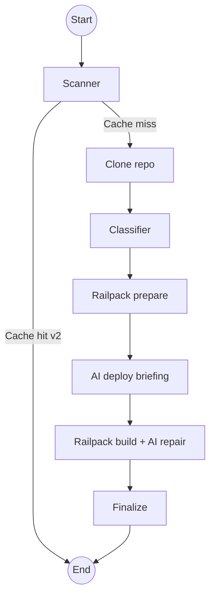

# SD-Artifacts Repo Analyzer (v2)

SD-Artifacts is a FastAPI service that answers: **given a GitHub `repo_url` and `package_path`, how do we deploy it?**

It uses **Railpack** to generate verified build plans, **LangGraph** to orchestrate the pipeline, and **Bedrock LLMs** for deploy briefings and autonomous build repair — not for writing Dockerfiles or compose files.

## What It Does

- Scans public or private GitHub repositories (scoped to `package_path`).
- Classifies deploy shape: static, Vite/static build, server app, or multi-package workspace.
- Runs `railpack prepare` → `railpack build` with AI repair loop (max 3 attempts per unit).
- Returns verified `railpack_plan` JSON + human-readable `deploy_briefing` for [smart-deploy.xyz](https://smart-deploy.xyz).
- Caches results in Supabase (`repo_url + commit_sha + package_path`, schema v2).
- Full audit trail: `pipeline_trace`, `repair_history`, `build_status`.

## Pipeline


```mermaid
graph TD
    Start(("Start")) --> Scan["Scanner"]
    Scan -->|Cache hit v2| End(("End"))
    Scan -->|Cache miss| Clone["Clone repo"]
    Clone --> Classify["Classifier"]
    Classify --> Prepare["Railpack prepare"]
    Prepare --> Briefing["AI deploy briefing"]
    Briefing --> Build["Railpack build + AI repair"]
    Build --> Finalize["Finalize"]
    Finalize --> End
```

## API (v2 — hard cut)

### POST /analyze

```json
{
  "repo_url": "https://github.com/user/repo",
  "package_path": "apps/web",
  "github_token": "optional",
  "max_files": 50,
  "commit_sha": "optional-cache-lookup",
  "refresh": false
}
```

Set `"refresh": true` to bypass Supabase cache and re-run the full pipeline (scanner cache + `commit_sha` lookup). Refreshed results replace the existing cache row.

### Response (excerpt)

```json
{
  "schema_version": 2,
  "build_status": "passed",
  "deploy_shape": "static_build",
  "deploy_units": [{
    "name": "web",
    "root": "apps/web",
    "type": "static_build",
    "port": 3000,
    "artifacts": { "railpack_plan": {}, "railpack_json": null }
  }],
  "deploy_briefing": "# How this deploy works\n...",
  "repair_history": [],
  "railpack_version": "0.22.2"
}
```

## Requirements

- Python 3.10+
- GitHub token (private repos / rate limits)
- Amazon Bedrock credentials
- Supabase (cache + audit log)
- **Railpack CLI** + Docker/BuildKit on the host (for build verification)
- `SD_API_BEARER_TOKEN` for API auth

## Setup

```bash
python -m venv venv
source venv/bin/activate
pip install -r requirements.txt
# Install Railpack: https://railpack.com
```

Apply Supabase schema: `supabase_schema.sql` (fresh) or `migrations/v2_schema.sql` (upgrade).

## Environment

```env
AWS_ACCESS_KEY_ID=...
AWS_SECRET_ACCESS_KEY=...
AWS_DEFAULT_REGION=...
BEDROCK_MODEL_ID=anthropic.claude-3-haiku-20240307-v1:0
SUPABASE_URL=...
SUPABASE_SERVICE_ROLE_KEY=...
SD_API_BEARER_TOKEN=...
SD_WORKFLOW_VERSION=sd-artifacts@local
SD_RAILPACK_VERIFY_TIMEOUT_SECONDS=300
```

## smart-deploy integration

smart-deploy consumes `deploy_units[].artifacts.railpack_plan` and builds with:

```bash
docker buildx build \
  --build-arg BUILDKIT_SYNTAX="ghcr.io/railwayapp/railpack-frontend" \
  -f railpack-plan.json \
  /path/to/cloned/repo
```

Pin `railpack_version` from the API response to the matching frontend image tag.

## MCP Server

```bash
python mcp_server.py
```

Cache resources (v2):
- `analysis-cache://{repo_url_b64}/{commit_sha}`
- `analysis-cache://{repo_url_b64}/{commit_sha}/{package_path_b64}`
