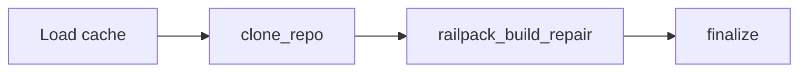

# Feedback Remediation Workflow (v2)

The feedback pipeline re-runs Railpack build verification with user guidance. It does not regenerate Dockerfiles, compose, or nginx configs.

## When to Use It

Use `POST /feedback` or `POST /feedback/stream` when:

- a prior `/analyze` run produced a cached v2 result for the same commit
- Railpack build failed or the deploy briefing needs correction
- you want to iterate on `railpack.json` overrides or `RAILPACK_*` env vars without a full rescan

## Execution Flow

1. The API loads the cached analysis row from Supabase (`repo_url + commit_sha + package_path`).
2. The repo is re-cloned at the cached commit.
3. `railpack_build_repair` runs with the user feedback injected into the repair LLM prompt.
4. The AI may patch `railpack.json` or env overrides and retry the build (max 3 attempts per deploy unit).
5. `finalize` assembles the updated v2 response and upserts the cache.

## Inputs

- `repo_url`
- `commit_sha`
- `package_path` (optional, defaults to `.`)
- `feedback`
- `github_token` (optional, for private repos on re-clone)

## Outputs

The response matches the v2 `/analyze` shape:

- `deploy_units[].artifacts.railpack_plan`
- `deploy_briefing`
- `repair_history`
- `build_status`
- `pipeline_trace`

## Streaming Behavior

`POST /feedback/stream` emits SSE events with:

- `progress` for each feedback node (`clone_repo`, `railpack_build_repair`, `finalize`)
- `complete` with the final payload
- `error` if cache lookup or remediation fails

## Failure Handling

- LLM-backed repair uses the shared retry wrapper with exponential backoff and jitter.
- If the cache row does not exist, feedback endpoints fail instead of running a fresh analysis.
- If build verification is disabled for the host environment, feedback re-clones the repo but skips Railpack build repair.
- If Railpack CLI or BuildKit is unavailable, build verification is marked skipped or failed accordingly.

## Practical Guidance

- Reference deploy unit names, ports, and failing build log lines in your feedback.
- Use streaming mode for dashboard or CLI progress visibility.
- Run `/analyze` first; feedback is iterative repair on an existing cached result.
